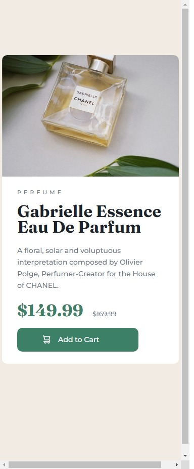

# Frontend Mentor - Product preview card component solution

This is a solution to the [Product preview card component challenge on Frontend Mentor](https://www.frontendmentor.io/challenges/product-preview-card-component-GO7UmttRfa). Frontend Mentor challenges help you improve your coding skills by building realistic projects. 

## Overview

### The challenge

Users should be able to:

- View the optimal layout depending on their device's screen size
- See hover and focus states for interactive elements

### Screenshot

-Desktop

-Mobile

### Links

- Solution URL: [https://onfiire.github.io/Product-Card/](https://onfiire.github.io/Product-Card/)

## My process

### Built with

- CSS Grid

### What I learned

 Adding icon to button

### Continued development

### Useful resources

## Author

- Frontend Mentor - [@onfiire](https://www.frontendmentor.io/profile/onfiire)

## Acknowledgments

Soulitons Clouds:
https://www.youtube.com/watch?v=Wa2n-Ke14q0
